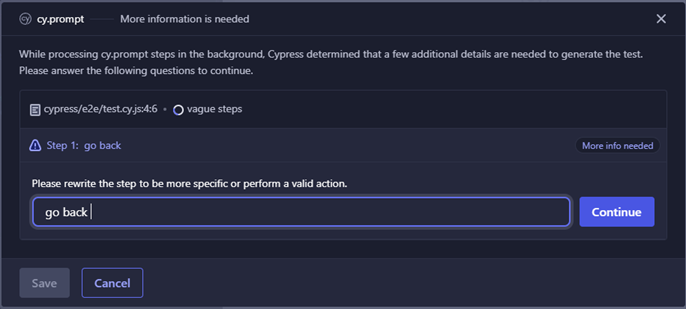
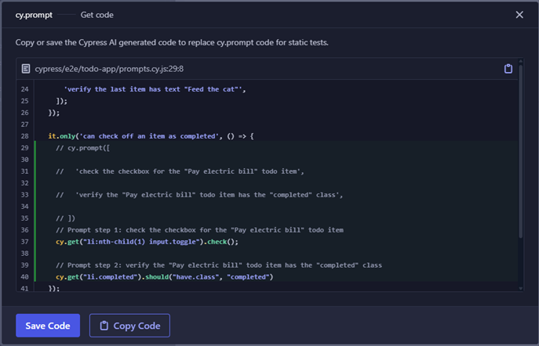

# cy.prompt() - First Impressions (October '25)

`cy.prompt()` is a new feature added to [Cypress](https://www.cypress.io/) as of v15.4.0 (October '25) that aims to make developing automated tests easier by using AI to convert natural language steps into executable Cypress test steps. The [`cy.prompt()` docs](https://docs.cypress.io/api/commands/prompt) provide a good introduction to this feature along with a number of examples of how it can be used.

I'm keen to explore how easy it is to get started with `cy.prompt()`, how effective it is and what limitations there are especially given this is still an experimental feature. This repo contains all the files I used to test this feature along with my detailed findings.

## Getting Started

Before we get on to how simple it is to set up a Cypress project to use `cy.prompt()` I want to briefly cover the basics of the project I am using for this. I have started a new project with a clean install of the latest Cypress version (v15.5.0). I then ran Cypress (`npx cypress open`) and configured the project for E2E testing allowing Cypress to create some default test specs for me. Of those, I have only kept `todo.cy.js` (which I have renamed [`example.cy.js`](cypress/e2e/todo-app/example.cy.js)) as I will be using Cypress's own todo app as the application under test in most scenarios. I have removed the comments from the example spec in order to make it easier to focus on the code itself but otherwise the tests are unchanged.

Having got a baseline project set up the next step was to add the `cy.prompt()` feature flag to the Cypress config file in order to enable the command. The final step was to connect the project to [Cypress Cloud](https://cloud.cypress.io/) to get a project ID and add that to the Cypress config file too. And that was it, I was then able to run my first `cy.prompt()` commands.

If you're not familiar with Cypress Cloud it is a companion to the usual Cypress test app that can record test runs for later debugging and analysis. It is more commonly used by enterprise-level organisations as it is generally an additional cost option but there is a free tier that can be used for running `cy.prompt()`. Note you don't have to actually record your test runs to Cypress Cloud in order to use `cy.prompt()`, just have a valid project ID and be signed in to Cypress Cloud.

## Writing Tests

I was impressed at how easy it was to get the new `cy.prompt()` command enabled on my project but how easy is it to actually make use of it? The docs suggest it should just be a case of creating tests containing the `cy.prompt()` command and passing in arrays of strings describing the test steps in natural language. To test this I copied the example todo app test spec and rewrote each scenario as a series of plain language steps (see [prompts.cy.ts](cypress/e2e/todo-app/prompts.cy.js)). These tests then run in the standard Cypress runner as any other test would. The plain language steps are run through an LLM to convert them to regular Cypress commands (`cy.visit()`, `cy.get()` etc) which are executed as normal.

Actually writing the tests was generally very straightforward but it wasn't entirely without issue. Some of the assertions in the example tests were tricky to write in a reliable and robust manner (e.g. verifying the number of items in the todo list) while others didn't work at all (e.g. verifying an element is not present). See [Issues and Limitations](#issues-and-limitations) for more details.

I was pleased to see it's not an "either-or" situation and `cy.prompt()` commands can be mixed with regular Cypress commands allowing one to take advantage of `beforeEach` hooks rather than having to include a "visit" step at the start of every plain language scenario for example.

How flexible is the language that can be used when writing the steps? I haven't tested this exhaustively by any means but I have tested a number of common variations on the terminology one might use when writing test steps e.g. "visit" v "open", "verify" v "confirm" etc. (see [language.cy.js](cypress/e2e/todo-app/language.cy.js) for details of the test scenarios executed). I'm pleasantly surprised to learn that the AI correctly interprets variations in the language used, even within the same test. Given the steps must be written in English (I haven't tested other languages) this flexibility should at least support native and non-native English speakers.

What about writing test scenarios in BDD/Gherkin format? Could existing manual test scenarios or acceptance criteria written in the Given-When-Then style be converted to `cy.prompt()` tests? As the [bdd.cy.js](cypress/e2e/todo-app/bdd.cy.js) spec shows, there is indeed support for Gherkin-style test steps. Not only are the standard Gherkin keywords (Given-When-Then-And-But) supported but the AI interpreter handled synonyms (Assuming-Once-Thus) as well as steps written in an explicit Arrange-Act-Assert format.

What about steps that cannot be interpreted by the AI? When that happens the Cypress runner will request more information from the user, allowing them to rewrite the step to be more specific or to rephrase it in a way the interpreter might understand better.



Once the user has rewritten any steps that the interpreter is struggling with they can save these changes back to the test spec automatically and re-run the tests. I think this is a pretty good solution - it keeps the user within the Cypress runner rather than forcing them back to their editor. However, in a future iteration of this feature I would like to see some indication of whether the AI understands the modified step before the user saves their changes.

### Plain Language v Code

Having written some tests as plain language prompts what is the next step? You could commit these prompt tests to version control and stop there. This has the advantage of giving you a test suite that is written in a way that everyone on the team should be able to understand regardless of how familiar they are with Cypress. Not only that but anyone should also be able to extend and maintain your test suite.

However, there are several limitations to sticking with the plain language format. Whenever you run your test suite you will be executing every `cy.prompt()` command and will soon hit a usage limit (currently 600 prompt calls per hour on a paid plan). You're also bound by the functionality supported by the interpreter which may restrict how much of your application you can meaningfully test.

Alternatively you can export the code automatically generated when Cypress interprets your plain language steps into regular commands and use this as your test suite. This is as simple as clicking the "Get code" button for any `cy.prompt()` command successfully executed within the Cypress runner. This pops up a dialog containing the equivalent Cypress code with buttons to copy it to the clipboard or save it, immediately replacing the original prompt test in your IDE.



As noted previously, you can combine `cy.prompt()` tests with "regular" Cypress tests allowing you to generate code for some of your prompts without needing to convert them all. Obviously generating the code from the prompts allows you to tweak the functionality and extend the tests with commands that are not supported by the interpreter. However, in order to do so one requires an understanding of how to use Cypress "properly" limiting who can read and maintain your test suite.

I encountered a few limitations when testing the code generation capability of `cy.prompt()`:

- You can't generate the code from your prompts if the test doesn't pass.
  - This makes sense in many ways but it does mean you can't use this feature to do most of the hard work for you to then modify the failing steps yourself. I ended up commenting out prompt steps in order to get something to pass before I generated the code, but if an action step is failing then the system may not be in the right state for your assertions anyway so this workaround wouldn't help.
- You can't auto-generate code for the whole spec at once
  - In fact you can only generate the code one `cy.prompt()` command at a time. This is not so bad if you only have one `cy.prompt()` command per test - you just need to generate the code for each in turn. However, if you have combined multiple prompt commands in a single test, perhaps separated by regular Cypress commands, it is not as straightforward.
- The code generation can fail if Cypress is not watching the spec file for changes (i.e. `watchForFileChanges: false` in Cypress config)
  - I had situations where generating the code for the first `cy.prompt()` command worked without issue but after that Cypress fails to show the generated code and you have to re-run the test containing the next prompt command you want code generating for. This makes it harder to run a whole spec file and generate code for all tests in one go without potentially hitting [usage limits](#usage-limits).

### Auto-Generated Code Quality

The ability to automatically generate code from plain language prompt steps is great but what is the quality of that code like? While I haven't extensively tested this capability I have seen enough to know I am not very impressed by it. The [generated-code.cy.js](cypress/e2e/todo-app/generated-code.cy.js) spec contains the same scenarios as [prompts.cy.js](cypress/e2e/todo-app/prompts.cy.js) but the prompts have been replaced by the equivalent code as automatically generated by Cypress.

It's worth noting that the `cy.prompt()` command is retained as a comment above the generated code allowing one to easily return to the prompt command if there are issues with the generated code. Each prompt step that is converted to regular Cypress commands is also prefixed with the prompt step number and prompt string as a comment for additional context. As such the code is documented (to a degree) so could be used as a way of learning how to use Cypress "properly". I would advise against that, however, as there are a number of issues with the code Cypress outputs. Let's take a look at the main issues.

I previously noted an issue with asserting the number of items in the todo list when writing my tests and the code for this assertion might indicate why that is.

```
// Prompt step 1: verify the todo list has 2 items
cy.get('ul.todo-list').should('have.descendants', 'li');
```

This is NOT performing the requested assertion. The above code verifies that the unordered list element with the `todo-list` class has at least one descendant (child element) with the `li` tag. There could be 1 todo item in that list, there could be 1000 - either way that assertion would pass.

While testing the support for different language styles, especially around assertions, I did notice that in some cases the code generated for the above assertion was better, e.g.

```
cy.get('ul.todo-list')
  .should('have.descendants', 'li:nth-child(2)')
  .should('not.have.descendants', 'li:nth-child(3)');
```

This at least verifies the todo list has 2 child `li` elements but is a hideously clunky way of doing so. I would never recommend using this form of assertion in this way. I would use

```
cy.get('ul.todo-list li').should('have.length', 2)
```

or at a push

```
cy.get('ul.todo-list').children('li').should('have.length', 2)
```

None of this is complicated Cypress code. My preferred solution uses a compound selector of the type I see used elsewhere in the generated code so is well within the capability of the interpreter. What I don't understand is why the interpreter favours the `have.descendants` assertion rather than the `have.length` assertion.

The generated code to verify the todo item text is also suboptimal. The text assertions use the `nth-child` CSS selector rather than favouring the `.eq()` Cypress command, e.g.

```
// Prompt step 3: verify the second todo item has text "Walk the dog"
cy.get('ul.todo-list li:nth-child(2)').should('have.text', 'Walk the dog');
```

rather than

```
cy.get('ul.todo-list li').eq(1).should('have.text', 'Walk the dog');
```

In this case I can at least understand why the interpreter might favour `nth-child` as that is indexed from 1 whereas `.eq()` is zero-indexed and as such it is probably easier for the code generator to directly use the number (or ordinal) from the prompt step rather than having to re-index it. I would always favour `.eq()` personally but I come from a coding background and am familiar with zero-indexed operations which may not be the case for the target audience for this feature.

That said, I don't quite understand why the interpreter favours the `nth-child` CSS selector when the prompt step explicitly uses terms that map directly to Cypress commands e.g. "first" or "last"

```
// Prompt step 2: verify the first todo item has text "Pay electric bill"
cy.get('ul.todo-list li:nth-child(1)').should('have.text', 'Pay electric bill');
```

could be simplified to

```
cy.get('ul.todo-list li').first().should('have.text', 'Pay electric bill');
```

I guess using `.first()` in the generated code may lead some to believe there are equivalent commands for other ordinals e.g. `.second()`, which there obviously isn't. I don't know if that is the reason the interpreter doesn't use such commands but if so, while I understand the use of code generation as a way of learning Cypress, I don't think it should replace more traditional training methods such as reading the documentation.

My final big issue is the selectors used within the generated code. I have already touched on the use of CSS selectors rather than using native Cypress commands but there is more to it than that. Take a look at this snippet of generated code:

```
// Prompt step 1: Type "Feed the cat" in the new todo input and press enter
cy.get('[data-test="new-todo"]').type('Feed the cat{enter}');

// Prompt step 2: verify the last item has text "Feed the cat"
cy.get('li[data-id="1761748971630"]').should('have.text', 'Feed the cat');
```

The prompt command in this test ran just fine but the generated code fails as the `li` element has a dynamic `data-id` value that changes between runs. The Cypress docs have a section on best practices when [selecting elements](https://docs.cypress.io/app/core-concepts/best-practices#Selecting-Elements) that mentions dynamic IDs as a potential issue. The advice is to use `data-*` attributes, which is what the interpreter has done here, but the attribute chosen has a dynamic value which immediately makes any command interacting with that element flaky. Someone unfamiliar with Cypress may not recognise this inherent issue with the code and be confused as to why the coded version of the test fails when the prompt version passed every time.

The suboptimal selector issue can also be seen in the following example:

```
// Prompt step 1: check the checkbox for the "Pay electric bill" todo item
cy.get('li:nth-child(1) input.toggle').check();

// Prompt step 2: verify the "Pay electric bill" todo item has the "completed" class
cy.get('li.completed').should('have.class', 'completed');
```

The assertion is especially worrying as it uses the class that is being asserted on as part of the selector. The step as written will pass and fail under the right conditions so is valid but it's a poor way of writing this assertion. If the todo item doesn't have the "completed" class the `cy.get()` will fail and Cypress will throw an error saying `Expected to find element: 'li.completed', but never found it.` which is factually correct but can be misleading when trying to debug the failure. You want the assertion itself to fail, not getting the element.

Both steps are interacting with the same todo list item yet select it in different ways. The second step could be rewritten to

```
cy.get('li:nth-child(1)').should('have.class', 'completed');
```

Now if the todo item doesn't have the "completed" class for whatever reason the assertion command will fail with a meaningful error message.

The final point to note when it comes to the generated code is that it is obviously unaware of any design patterns (e.g. Page Object Model) that are in place. The interpreter generates commands based on the DOM and does not assume any context within a Cypress test framework. Each generated command is intended to run as-is. As such, the value of using `cy.prompt()` within projects with the POM design pattern is significantly diminished.

## Untested Functionality

There are aspects of `cy.prompt()` that I have not yet tested myself but I do want to briefly share my thoughts on what I have seen of them so far.

### Placeholders

Placeholders are a way of avoiding cache invalidation when using dynamic data in `cy.prompt()` commands. Often one will want to repeat a test scenario with different inputs e.g. attempting to login with a variety of user credentials. You wouldn't write this as a series of separate tests (login as user 1, login as user 2 etc), you'd use a loop iterating over your users running the same steps for each one. However, due to the different user credentials, `cy.prompt()` would treat each iteration as a completely new set of prompt steps and would reach out to the AI every time resulting in slow tests. By using placeholders instead of the user credentials directly in the prompts the steps are properly cached and only the first iteration needs to call the AI interpreter.

The [placeholders docs](https://docs.cypress.io/api/commands/prompt#Placeholders) show an example of this in practice, albeit for a different use case.

In my opinion placeholders detract from the simple beauty of the basic `cy.prompt()` command. Anyone can understand an array of plain language strings but once placeholders are introduced the barrier to understanding the tests is immediately raised. I imagine it would be quite easy for someone without a coding background to forget to use double braces around their placeholders within the prompts and potentially get frustrated trying to debug failing steps. Placeholders also make it more complicated to convert existing manual tests/acceptance criteria to useful Cypress prompts.

The [placeholders example](https://docs.cypress.io/api/commands/prompt#Example-usage) mostly glosses over a very important use case - preventing sensitive information being sent to the Cypress AI. The example does show a placeholder being used to prevent an admin password being sent to the AI but this is something I would probably make a lot more of in the documentation were it up to me. It's certainly something I would be interested in testing in depth but I don't know how easy that is. Can a third-party see exactly what is being sent to the Cypress AI? Do the docs gloss over the use of placeholders for sensitive data because they don't want people digging into what access they are granting the AI?

### Self-Healing Tests

Resilience can be a real issue for many UI/E2E tests. You write a bunch of tests which work fine, until even a minor change in the UI screws everything up and you have to spend time fixing your tests. Cypress claim `cy.prompt()` solves that problem. Rather than generating code from your prompts you leave them as the plain language prompts and let the AI handle any changes to your application. You no longer need to worry about the UI layout changing, the interpreter will find the relevant elements and run your tests as normal.

I was using a todo app hosted by Cypress for my `cy.prompt()` testing so I haven't tested the self-healing nature of prompt tests myself but I have seen examples from others who have. Brian Mann, founder of Cypress, gave a [presentation](https://youtu.be/Oz_lMaglxOY) at CypressConf 2025 during which he demonstrated the self-healing (starting at around [16:00](https://youtu.be/Oz_lMaglxOY?t=960)). His example worked well, as you would expect really. However, there are other examples on YouTube (such as [this one](https://youtu.be/H87RsGwmVTU?t=650) from Artem Bondar) that suggest there are potential issues with some of the self-healing capabilities. It seems further testing of this would be required if you wanted to have self-healing tests for your own app.

Another thing to consider is that you might want your tests to fail if the UI changes. Your test suite may be the canary down the coal mine alerting you to any unexpected changes in the frontend code. A failing test indicates something has changed and thus needs your attention. If your tests self-heal then you might not be aware of such changes.

## Performance

To test the speed of tests written using `cy.prompt()` I ran the [prompts.cy.js](cypress/e2e/todo-app/prompts.cy.js) spec in the Cypress runner (headed). On the first run the spec took around 25s to run all 6 tests. In each case the prompt steps were new to the AI so had to be interpreted to standard Cypress commands which obviously increases the overall run time. The prompts are cached so if they remain unchanged then subsequent runs should be faster and I found it took around 12s to run the spec once cached.

The Cypress command runner logs details of what is happening in the browser console, including whether a prompt was previously cached and the time until the first step executes i.e. the time taken to interpret the prompt. Based on my testing this can add 200-400ms for each `cy.prompt()` call in your test even when the prompts are already cached.

How does this compare to the same tests written in standard Cypress? The [example.cy.js](cypress/e2e/todo-app/example.cy.js) spec runs in around 3s so is around 4x faster. When you bear in mind this spec contains more assertions than the equivalent `cy.prompt()` tests the performance difference is even greater.

## Issues and Limitations

### Assertions

The first issue I encountered was the difficulty `cy.prompt()` had verifying the number of items in the todo list. I tried several ways of phrasing the step including:

- 'verify there are 2 items in the list'
- 'verify the list is 2 items long'
- 'verify the list has a length of 2'

but in most cases Cypress throws a `Could not find a target element for: ul.todo-list li` error even though a search for that selector in the DOM yields the two expected elements. This behaviour was inconsistent - some prompt scenarios were able to verify the number of items in the todo list and during my testing I found adding further steps to the scenario could help. For example, a scenario that visited the todo app, verified the number of items in the list and verified the text of each todo item often passed but without those text assertions the test fails.

I noted similar issues with counting the number of products on an [ecommerce site](https://swag.cypress.io) which suggests this may be a particular weakness of the LLM used to process the natural language strings.

The interpreter also showed some concerning behaviour when it came to identifying elements. For example, the [todo app](https://example.cypress.io/todo) under test has a footer element at the bottom of the todo list and another footer element at the bottom of the page. There is a count of the number of remaining todo items in the list footer whereas the page footer contains some instructional text. Yet the following commands both pass and assert against the same element (the list footer):

- 'verify the footer contains "2 items left"'
- 'verify the page footer contains "2 items left"'

The latter is a false positive and raises the question of how one should reference the actual page footer in prompt steps should one wish to assert against it.

It is concerning that most of the issues I encountered tended to be with assertion steps rather than action steps since assertions are a key part of most tests. We have already seen that the quality of the auto-generated code is generally poor for assertions. It makes me doubt how much `cy.prompt()` tests could be relied upon, whether they remain plain language or are interpreted into standard Cypress commands.

### Debugging

Debugging prompt commands seems to be a lot trickier than standard Cypress commands. Yes, you can see what commands the prompt has been interpreted to but if a prompt step fails there is often no actual result, just a message saying that the step doesn't have the expected result e.g. `"expected '<ul.todo-list>' to have descendants '2'"`. This example is rather a nuanced failure as it is easy to interpret that error message as meaning the todo list has a number of descendants but that number is not 2, but that's not what it is trying to tell you. If you're not that familiar with the "descendants" assertion you wouldn't recognise that though. What the message is actually saying is that the todo list has no descendant elements matching a selector of "2". This another symptom of the LLM returning a poor choice of assertion for the number of child elements. An assertion such as `cy.get('ul.todo-list li').should('have.length', 3)` would return a more informative error message e.g. `"Not enough elements found. Found '2', expected '3'."`

### Flawed Assumptions

My testing indicates the underlying AI used to interpret the plain language steps makes certain assumptions that could be flawed. Suppose the todo list contains tasks to "Walk the dog" and "Feed the cat". What would you expect to happen if you wrote a prompt step such as 'double-click the "Feed the dog" field'? I would expect the step to fail as there is no such todo item, or maybe Cypress would pop-up the dialog prompting the user to clarify the step. Instead the test step interacts with the "Feed the cat" item. It assumes that even though you typed "Feed the dog" you really meant "Feed the cat".

Assumptions such as these could be very dangerous if there are multiple similar items in a list or similar elements on a UI screen. How can you trust the AI to select the right one?

### Unsupported Commands

Given `cy.prompt()` is still an experimental feature it is not surprising that there are a number of commands it doesn't currently support. Some of these are clearly stated in the [docs](https://docs.cypress.io/api/commands/prompt#Experimental-release-limitations) whereas others have come to light during my testing of this feature.

Of the documented limitations the lack of support for "not.exist" assertions seems like the biggest issue to me. Being able to assert that following a given action certain UI elements are no longer present is a massive part of a lot of testing (and if not, it should be!). Without that support in the natural language processor one has to omit such assertions from the prompts and add them in manually using standard Cypress commands. Combining prompts with native Cypress in this manner may mean tests don't self-heal (one of the big selling points of `cy.prompt()`). It also means prompts may need to be split into multiple commands either side of standard Cypress commands resulting in the prompt command rate limit being hit sooner than expected.

While testing support for navigation commands ("go to", "open", "visit" etc) I found that commands such as "go back", "go back to previous page" and "press browser back button" were unsupported - the Cypress interpreter sought clarification each time. This surprised me as given what I had seen to that point the general command support was pretty good and Cypress has a `cy.go()` command that can accept "back" or "forward" as arguments to traverse the browser history.

Bearing in mind Cypress has no in-built image verification capability (one must use a third-party plugin for visual testing) I was not surprised to find that image-based assertions (e.g. 'verify the 1st product image shows a bomber jacket') failed, although the fact that this prompt was interpreted into an assertion on the value of the `img` element did confuse me. Would an `img` element ever have a value? I did wonder if the interpreter might assert on the alt text or any label attributes on the image but that doesn't seem to be the case.

### Usage Limits

The free Cypress Cloud plan (which is what I am using) allows a maximum of 100 `cy.prompt()` commands to be run per hour (it's 600/hour on paid plans). I couldn't see any indicator of how many prompt commands I have run in a given time period anywhere so it seems it is down to the user to track their own usage. I was only aware I had hit my limit when a prompt test failed with an appropriate error in the Cypress runner. Interestingly it sems the limit resets every hour on the hour so is based on actual clock time rather than the number of calls over the past 60 minutes. This means you could make 100 calls at 09:59 and another 100 at 10:01, for example, even though that would be 200 calls in a 2 minute period.

Rate limits are not uncommon and are to be expected for features such as `cy.prompt()` given it calls out to AI services. I think the free tier limit is actually pretty generous but it also needs to be as it is incredibly easy to rack up the number of prompt commands executed even in a simple test suite. My issues with some assertion prompts (which are well documented in this readme) meant I would tweak prompts and run the test again in an attempt to find robust and reliable steps, each attempt pushing me closer to the rate limit.

I believe every `cy.prompt()` call counts towards the usage limit regardless of whether the prompt was previously cached. The interpreter still runs for cached prompts but it doesn't need to reach out to the LLM to get back the equivalent Cypress commands. This would limit the usability of prompts for self-healing tests in larger test suites even on paid plans as it effectively limits the number of such tests or throttles how often they can be run.

There are a few tips for working within the usage limits that I found during my testing:

- Be wary of using `cy.prompt()` in hooks such as `beforeEach` as every time the hook runs (e.g. before each test in the spec) the prompt command is called. Replace these prompts with the equivalent code as soon as possible so that you can maximise the value of yor prompt commands by using them in actual tests.
- You may want to set `watchForFileChanges: false` in the Cypress config file to give you better control over when tests are re-run during active development. This setting defaults to true meaning Cypress will attempt to re-run an open spec every time the file changes so if you are actively editing a spec make sure it is not open in the Cypress runner or disable watching for file changes, but be aware of the [potential issues with code generation](#plain-language-v-code).
- Use `.skip` and `.only` modifiers to control which tests run within a spec so that you only execute the prompt commands that are absolutely necessary for what you are currently doing.

## Costs

While it is an experimental feature `cy.prompt()` will be free to use although subject to rate limits. Whether the feature will continue to have a free tier once it is generally available remains to be seen. In his CypressConf 2025 keynote presentation, Cypress founder Brian Mann said "Pricing will aim to be accessible, affordable, and predictable for teams of all sizes.". It may aim to be all those things but I shall wait and see what the reality is when the time comes.

Anything that uses any hosted services also has non-financial costs and the prompt command is no exception. Such costs are somewhat hidden and it may be that only Cypress themselves truly know what those costs are. The main concern would be around data privacy and security. The documentation for this feature says "We never use your prompts to train AI models" but what aren't they telling us? Prompts may not be used to train AI models but how is that data processed and stored? Most tests are run in an unobfuscated pre-production environment so how much of the DOM is stored when prompts are interpreted? When prompts are cached what form does that take and what other data is stored with them?

There is no such thing as a free lunch so if we are not paying financially to use this feature should we assume we are paying in some form of data?

## Conclusions

It's hard not to be impressed by what Cypress have delivered already in terms of functionality for the `cy.prompt()` command. It is still an experimental feature so I expect there to be gaps in what it is capable of but it is clear the team behind it have thought about how it would be used in the real world and have done their best to cater for that.

Pros:

- Very easy to setup and write first tests
- Language support is better than I expected, especially in terms of verbiage and syntax
- Being able to mix prompts and standard Cypress commands greatly increases the flexibility
- The code to which the prompt commands are interpreted can easily be exported
- Fairly generous usage limits for free tier users

Cons:

- Significant issues with some assertions
- The quality of some of the auto-generated code is questionable
- Failing prompts can be difficult to debug
- Performance is noticeably worse than standard Cypress commands

Overall it feels like the barrier to entry for automated testing has definitely been lowered but I question how useful `cy.prompt()` will actually be in the long run for most teams. It can definitely help get a proof of concept test suite up and running faster but beyond that...? The rate limits effectively impose a restriction on how large a prompt test suite can get whereas the generated code can be flaky and uses several sub-optimal commands. In other words, to effectively scale up from a proof of concept will take someone who understands Cypress and knows how to get the best from it.

`cy.prompt()` was designed to make automated testing more accessible but I can see a future where it has been used to generate a lot of low-quality, hard-to-maintain tests that offer low value and may actually increase the load on experienced Cypress engineers to sort things out properly. I don't think it is going to be replacing too many QA automation engineers at this point in time but as the feature is developed further it is certainly worth keeping an eye on.
